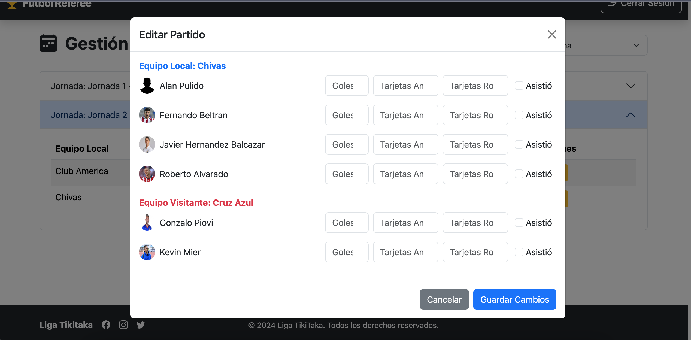

# **Soccer League Management**


## **Table of Contents**

- [**Soccer League Management**](#soccer-league-management)
  - [**Table of Contents**](#table-of-contents)
  - [**Project Description**](#project-description)
  - [**Key Features**](#key-features)
  - [**Technologies Used**](#technologies-used)
  - [**Prerequisites**](#prerequisites)
  - [**Installation Guide**](#installation-guide)
  - [**Project Structure**](#project-structure)
  - [**Authentication and Roles**](#authentication-and-roles)
    - [**Available Roles**](#available-roles)
    - [**Security**](#security)
  - [**Data Models**](#data-models)
    - [**League**](#league)
    - [**Team**](#team)
    - [**Player**](#player)
    - [**Match**](#match)
  - [**Main Routes**](#main-routes)
    - [**General**](#general)
    - [**Administrator**](#administrator)
    - [**Captain**](#captain)
    - [**Referee**](#referee)
  - [**Detailed Features**](#detailed-features)
    - [**Dynamic Home Page**](#dynamic-home-page)
    - [**Admin Panel**](#admin-panel)
    - [**Captain Dashboard**](#captain-dashboard)
    - [**Referee Tools**](#referee-tools)
  - [**Screenshots**](#screenshots)
    - [**Login Page**](#login-page)
    - [**Admin Dashboard**](#admin-dashboard)
    - [**Team Management**](#team-management)
    - [**Referee Management**](#referee-management)
  - [**Future Enhancements**](#future-enhancements)
  - [**Contributions**](#contributions)

---

## **Project Description**

**Soccer League Management** is a comprehensive web application tailored for managing soccer leagues. It streamlines operations for administrators, team captains, and referees by providing tools to organize leagues, oversee teams, manage players, and schedule matches. Enhanced with role-based authentication, it ensures a secure and efficient user experience.

---

## **Key Features**

- **League Management**: Create, edit, and delete leagues.
- **Team Management**: Manage teams, assign captains, and maintain performance statistics.
- **Player Management**: Add, edit, and remove players with team-based limits.
- **Match Scheduling**: Organize, edit, and delete matches across different jornadas.
- **Dynamic Statistics**:
  - Identify top scorers.
  - Highlight best defensive teams.
  - Calculate average goals per match.
- **Role-Based Access**: Tailored functionalities for admins, captains, and referees.

---

## **Technologies Used**

- **Backend**:
  - Node.js
  - Express.js
  - Sequelize (ORM for databases)
  - SQLite
- **Frontend**:
  - Handlebars.js (templating engine)
  - Bootstrap (responsive design)
- **Authentication and Security**:
  - Passport.js
  - express-session
  - connect-session-sequelize
- **Additional Tools**:
  - Multer (file uploads)
  - Moment.js (date manipulation)
  - TypeScript
  - HTTPS with SSL certificates.

---

## **Prerequisites**

1. Node.js (version 16 or higher).
2. npm (included with Node.js).
3. SQLite for database management.
4. SSL Certificates (`key.pem`, `cert.pem`).

---

## **Installation Guide**

1. Clone the repository:
   ```bash
   git clone <REPOSITORY_URL>
   cd soccer-league-management/webapp
   ```

2. Install dependencies:
   ```bash
   npm install
   ```

3. Compile TypeScript code:
   ```bash
   npm run build
   ```

4. Start the server:
   ```bash
   npm start
   ```

5. Access the application in your browser:
   ```
   https://localhost:3000
   ```

---

## **Project Structure**

```plaintext
soccer-league-management/
├── webapp/
│   ├── src/
│   │   ├── routes/
│   │   │   ├── adminRoutes.ts
│   │   │   ├── captainRoutes.ts
│   │   │   └── refereeRoutes.ts
│   │   ├── model/
│   │   ├── views/
│   │   ├── config/
│   │   ├── public/
│   │   ├── middlewares/
│   │   │   └── authMiddleware.ts
│   │   └── server.ts
│   ├── uploads/
│   ├── package.json
│   └── tsconfig.json
```

---

## **Authentication and Roles**

### **Available Roles**
1. **Administrator (admin)**: Comprehensive control over leagues, teams, players, and matches.
2. **Captain (captain)**: Manages their team and assigned players.
3. **Referee (referee)**: Oversees match management and records performance statistics.

### **Security**
- Implements `passport.js` for local authentication.
- Utilizes middleware (`isAuthenticated`, `hasRole`) to secure routes.
- Manages sessions with `express-session` and SQLite storage.

---

## **Data Models**

### **League**
- **Fields**: `id`, `name`, `totalGoalsFor`, `matchesPlayed`.
- **Relationships**: Associated with teams, players, jornadas, and matches.

### **Team**
- **Fields**: `id`, `name`, `leagueId`, `captainId`, `logo`, `balance`, `goalsFor`, `goalsAgainst`, `points`.
- **Relationships**: Belongs to a league, includes players, and participates in matches.

### **Player**
- **Fields**: `id`, `name`, `position`, `teamId`, `leagueId`, `goals`, `yellowCards`, `redCards`.
- **Relationships**: Member of a team and a league.

### **Match**
- **Fields**: `id`, `jornadaId`, `homeTeamId`, `awayTeamId`, `date`, `scoreHome`, `scoreAway`.
- **Relationships**: Linked to a jornada, involves home and away teams.

---

## **Main Routes**

### **General**
- `/`: Main page displaying league-wide statistics.
- `/login`: User login.
- `/logout`: User logout.

### **Administrator**
- `/dashboard/admin/ligas`: League management.
- `/dashboard/admin/equipos`: Team management.
- `/dashboard/admin/jugadores`: Player management.
- `/dashboard/admin/partidos`: Match management.

### **Captain**
- `/dashboard/captain/jugadores`: Manage team players.

### **Referee**
- `/dashboard/referee/partidos`: View and manage matches.

---

## **Detailed Features**

### **Dynamic Home Page**
- Displays aggregated league statistics.
- Highlights top scorers and best defensive teams.
- Lists upcoming matches by jornada.

### **Admin Panel**
- **League Overview**: Create, edit, and archive leagues.
- **Team Insights**: Assign captains, view performance data, and handle team transfers.
- **Player Roster**: Manage player statistics and ensure fair play compliance.

### **Captain Dashboard**
- View and manage the team roster.
- Upload player images and maintain uniform branding.
- Monitor team performance metrics.

### **Referee Tools**
- Oversee match scheduling.
- Record match outcomes, player statistics, and disciplinary actions.

---

## **Screenshots**


### **Login Page**


### **Admin Dashboard**


### **Team Management**


### **Referee Management**




---

## **Future Enhancements**


1. **User Notifications**: Email or in-app alerts for match updates and deadlines.
2. **Advanced Analytics**: Graphical insights on team and player performance.
3. **Integration with External APIs**: Fetch live soccer data for added realism.

---

## **Contributions**

Contributions are welcome! Please follow these steps:

1. Fork the repository.
2. Create a branch for your feature or fix: `git checkout -b feature/new-feature`.
3. Commit your changes: `git commit -m 'Add new feature'`.
4. Push your changes: `git push origin feature/new-feature`.
5. Open a Pull Request.

